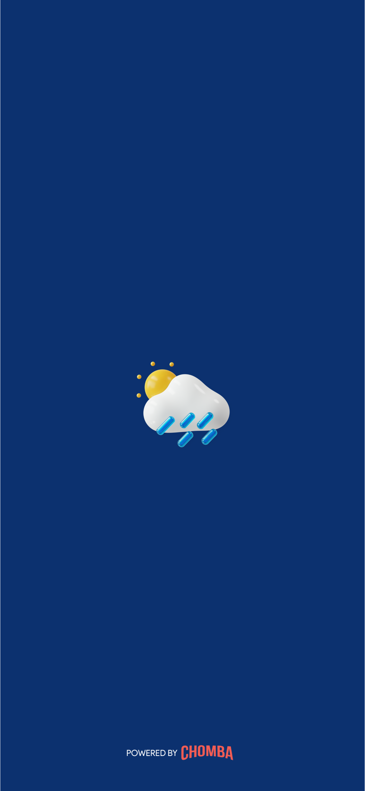
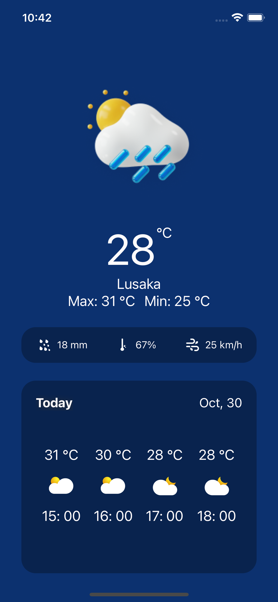
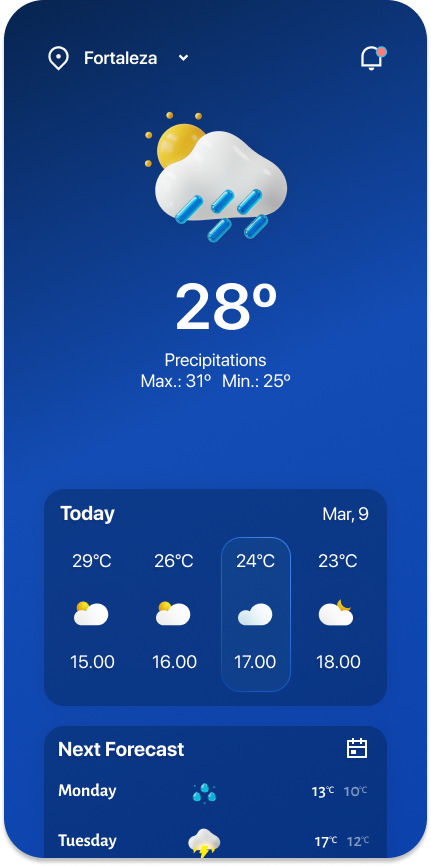

# WeatheApp by Chomba - Expo-cli | Typescript

Came accross this design by [Rebeca Sousa](https://www.figma.com/@becabelin)

## Features ✨

The is a very minimal and lightweight design.

1. Splash screen
2. Home screen 🤦🏾‍♂️

## Screenshots

|            Splash             |            Home             |         Figma design         |
| :---------------------------: | :-------------------------: | :--------------------------: |
|  |  |  |

## Future works

Provided more time, there are a few things I can need improving.

1. Add gradient to background color
2. Add Menu bar with drop down location selection
3. Add Notifications 🧪
4. Add tests 🧪 💀
5. Improve UI 👌🏽

## Stay creative 🚀
